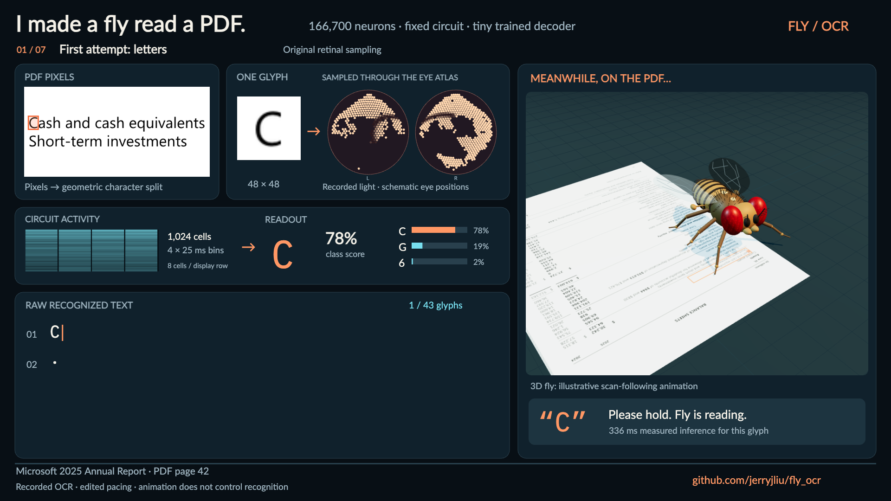

# Fly OCR

**Can a fixed fruit-fly circuit learn to recognize printed characters?** This experiment feeds glyph pixels into a MaleCNS connectome simulation and trains a small decoder on its activity. It runs locally on a Mac, recognizes letters and numbers, and preserves its mistakes.

[](https://github.com/jerryjliu/fly_ocr/releases/download/social-v1/fly-ocr-social.mp4)

**[Watch the 1:45 social cut](https://github.com/jerryjliu/fly_ocr/releases/download/social-v1/fly-ocr-social.mp4)** · [Original 2:56 compilation](https://github.com/jerryjliu/fly_ocr/releases/download/v0.1.0/fly-ocr.mp4) · **[Research report (PDF)](docs/fly-ocr-research-report.pdf)** · [Report source](docs/research-report.md) · [Model card](MODEL_CARD.md)

The social cut opens on character recognition and puts an animated 3D fly on the source PDF beside the results. Its body motion is illustrative; all OCR output, retinal samples and spike counts come from the saved experiment. [Video methods and reproduction](docs/social-video.md).

The circuit retains **166,700 neurons and 25,582,938 connections**. All internal weights are frozen. A 64-unit nonlinear decoder learns from four bins of 1,024 downstream neurons: **266,628 trained parameters**, one **100 ms** circuit presentation per glyph. It is an exploratory model with simplified dynamics and engineered visual input, not evidence that a biological fly reads.

## What works

| Measurement | Original letter input | Calibrated letter input |
| --- | --- | --- |
| 68-class benchmark, 1,632 glyphs | 74.9% | **87.6%** |
| Letters subset, 1,248 glyphs | 71.9% | **85.0%** |
| Two fresh fonts, 544 glyphs | 77.8% | **84.9%** |
| Eight PDF lines, 176 reference characters | 19.3% character error | **5.7% character error** |

Only **1/8 PDF lines is exactly correct**. Font-family diversity is small, and the older benchmark had already been inspected before this iteration. The separate numeric checkpoint scores 93.9% on its 800-glyph test; selected numeric tables reach 21/21 and 44/45 exact cells. A 3-degree tilt breaks segmentation. [All results and limitations](docs/research-report.md).

The main gain came from fixing missing input coverage. A square-root count transform adds a modest improvement without a larger decoder. A conventional raw-pixel model is better on the earlier digit task; this project does not establish a practical or biological OCR advantage.

## Why the eyes look like eyes again

The compound-eye panel shows **recorded sampled light at schematic positions derived from the original left/right column map**. Each value keeps its receptor identity. The calibrated model still samples the full glyph; changing the drawing leaves all predictions unchanged.

The oval outlines and hexagonal facets are presentation graphics, not measured optics or reconstructed ommatidia. The neural panel separately shows actual recorded spike counts. Original-input checkpoints remain available for the accuracy/fidelity comparison. [Atlas methods](docs/retinal-atlas.md).

## Watch locally without a graph download

Requires Node.js 22.13 or newer. The viewer is a static React/Vite app; it uses bundled recordings, needs no Python or cloud account, and sends no document data anywhere.

```sh
git clone https://github.com/jerryjliu/fly_ocr.git
cd fly_ocr/viewer
npm ci
npm run dev
```

Open the printed local URL. Select an example, play or scrub the replay, and inspect the raw results. The default is the calibrated two-line letter example. A direct example link can use `?example=calibrated-labels` or `?example=tilted-table`.

```sh
npm run build       # static site in viewer/dist
npm run check:replay
```

The fly is an animated cursor, and timing is edited. Recorded class scores are not calibrated probabilities of correctness. Green/orange evaluations are computed separately after recognition. No expected words or table schema enter inference.

## Run new recognition

Tested on an Apple M2 Pro with 32 GiB RAM, Python 3.11 and a C++ compiler. On macOS, install Xcode Command Line Tools for the compiler. Install [uv](https://docs.astral.sh/uv/). Allow several GiB for source and graph caches, with at least 10 GiB free for setup and experiments. Raster PDF rendering additionally needs Poppler (`pdftoppm`); image recognition does not.

From the repository root:

```sh
uv sync --python 3.11 --extra dev
uv run python scripts/preflight.py
uv run flyocr download
uv run flyocr prepare

# Letters, digits and six punctuation marks; upright text crop
uv run flyocr recognize demo/examples/calibrated-labels/crop.png --letters --output output/my-text
uv run flyocr verify-replay --run output/my-text --artifact artifacts/letters-v2

# Original letter mapping, for comparison
uv run flyocr recognize demo/examples/trained-labels/crop.png --artifact artifacts/letters --output output/original-text

# Numeric table, with geometric row/column reconstruction
uv run flyocr recognize demo/examples/income-table/crop.png --table --output output/my-table
```

The trained checkpoints are included. Downloads are checksummed, public and resumable; no account token is required. After preparation, recognition is local. Inference does not require PyTorch or a GPU. The Mac was sufficient for this workload; a cloud run is not claimed.

Outputs include `run.json`, `predictions.csv`, normalized glyphs and segmentation geometry. Numeric table mode also writes `table.csv` and `table.json`.

To rasterize a PDF region:

```sh
uv run python scripts/fetch-example.py
uv run flyocr render data/source/microsoft-2025.pdf --page 42 --region .08 .197 .396 .229 --output output/crop
uv run flyocr recognize output/crop/crop.png --letters --output output/pdf-text
```

The region is a manually chosen fractional box. There is no automatic whole-document table discovery.

## What is outside the fly circuit?

Thresholding, rule removal, line/glyph splitting, baseline normalization, word gaps and table geometry are conventional preprocessing and reconstruction. The circuit receives one glyph at a time, resets between glyphs, and supplies the decoder's features. There is no embedded PDF text, dictionary, language model, word correction, or learned reading policy.

The letter alphabet is `0123456789,.-()$ABCDEFGHIJKLMNOPQRSTUVWXYZabcdefghijklmnopqrstuvwxyz`. Spaces come from geometry. Unsupported characters may be forced into known classes. Touching text, skew, merged cells, exotic fonts, handwriting, multilingual paragraphs and semantic table interpretation are outside the demonstrated scope. `--letters` and numeric `--table` are intentionally separate modes.

## Verify the evidence

```sh
uv run pytest -q
uv run python scripts/verify-recordings.py
```

Replay verification needs the saved readouts and crops, not the connectome or network access. It reproduces class scores from counts, checks glyph pixels, and rechecks text segmentation. The small-network tests include an independent Brian2 dynamics comparison. Scientific results are saved measurements, not outcomes implied by passing unit tests.

## Reproduce training and media

Prepare the graph as above. The letter corpus uses bundled OFL fonts, disjoint families and synthetic perturbations. Existing artifacts are frozen; use a separate working copy for experiments that overwrite training outputs.

```sh
uv run flyocr glyphs --letters
uv run --extra benchmarks python scripts/train-letters.py
uv run --extra benchmarks python scripts/train-letters-v2.py --workers 2
```

The final evaluation script's fresh-font challenge expects macOS Georgia and Verdana; these proprietary font binaries are not included. Training and benchmark generation use the bundled open fonts. [Protocol and stages](docs/input-calibration.md) · [Original numeric methods](docs/methods.md).

After installing viewer dependencies:

```sh
uv run --extra video python scripts/export-video.py --examples calibrated-labels,calibrated-heading,calibrated-labels-more
uv run --extra video python scripts/export-compilation.py
uv run --extra video python scripts/export-social.py
uv run --extra report python scripts/report-figures.py
uv run --extra report python scripts/build-research-report.py
```

Video rendering uses a bundled FFmpeg binary. The original compilation uses the viewer's drawing function and is a captioned 2:56 MP4, 1920 x 1080 at 24 fps, without audio. Individual examples remain 40 seconds each. The separate 1:45 social cut uses a dedicated canvas layout and a procedural Three.js fly, rendered in headless Chrome. Its first frame already contains a prediction. All video manifests record source-run hashes; the social manifest additionally fingerprints its scene, layout and timing code.

The social renderer uses an installed macOS Chrome automatically. Elsewhere, run `npx playwright install chromium` in `viewer`, or set `FLYOCR_CHROME` to an installed Chrome/Chromium executable. Use `FLYOCR_PREVIEW_ONLY=1` for still previews. Neither the original compilation nor its release asset is overwritten.

## Repository contents and provenance

- `src/flyocr`: image pipeline, fixed circuit, trained readout and verification.
- `artifacts`: compact trained checkpoints, metrics, graph manifest and retinal atlas.
- `demo`: raw recorded inference, attributed crops, videos and compilation.
- `docs`: research report, figures and methods; `reports`: supporting measurements.
- `assets/fonts`: openly licensed source fonts with notices and hashes.
- `viewer`: static replay app and video renderers; `tests`: focused correctness checks.

Large graph downloads, environments, caches, logs, local hosting settings and private machine paths are excluded. The initial public commit is a clean export rather than the local experiment history. `scripts/package-public.py` recreates an audited archive without Git metadata; `PUBLIC_MANIFEST.json` fingerprints the export.

Connectome: [MaleCNS v1.0 / HHMI Janelia and collaborators](https://male-cns.janelia.org/download/), CC BY. Importer, retinal projection and native dynamics adapt [DOOMFLY](https://github.com/nftechie/doomfly/tree/71ecf53d78eaffaf1a57ed7b0ccf5d458abc9f33), MIT. PDF excerpts: [Microsoft 2025 Annual Report](https://www.sec.gov/Archives/edgar/data/789019/000119312525245177/d61995dars.pdf), separately attributed. Project code is MIT; the dataset, fonts, dependencies and document pixels retain their own terms. See [third-party notices](THIRD_PARTY_NOTICES.md).
