# Fly OCR
## A fixed fly circuit, a small trained decoder
Research report | 12 September 2026 | Jerry Liu

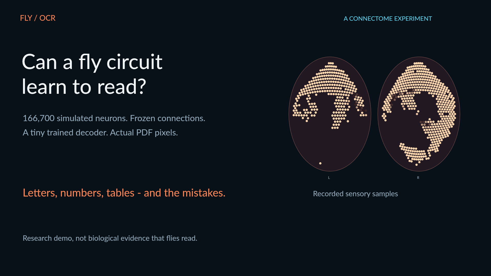

**Can a connectome-constrained fly simulation supply useful signals for recognizing printed characters?** This project sends isolated glyph pixels through a fixed MaleCNS circuit and trains a compact readout on downstream spike counts. It runs locally on an Apple M2 Pro. It is a playful computational experiment, not evidence that a biological fly can read.

The calibrated 68-class model recognizes **1,429/1,632 benchmark glyphs (87.6%)**, including **1,061/1,248 letters (85.0%)**. On eight selected annual-report lines, character error rate falls from **19.3% to 5.7%** compared with the original mapping. Only one line is completely correct. A new compound-eye atlas restores the fly-like visual presentation while leaving every recorded neural response and prediction unchanged.

**What is included:** methods, equations, input diagnosis, model comparisons, raw document errors, controls, compute measurements, limitations, reproduction instructions, and a compilation of recorded inference.

<!-- pagebreak -->
# 1. What the experiment actually does

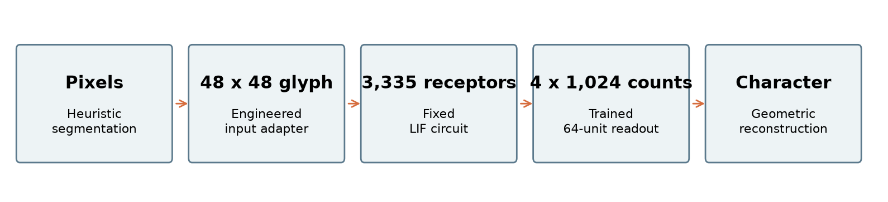

The central boundary is simple: the connectome transforms sensory currents into activity. Conventional image geometry isolates characters before simulation and assembles strings afterward. The trained component sees neural counts, not glyph pixels. All internal synaptic weights remain fixed.

| Stage | Implementation and role |
| --- | --- |
| Document input | Render a manually selected PDF region at 300 dpi, or accept a raster crop. Embedded PDF text is never used for recognition. |
| Segmentation | Threshold ink below 160; remove long horizontal rules; use horizontal and vertical projections to find rows and glyph boxes. Text mode merges nearby dots and cautiously splits touching pairs. |
| Normalization | Preserve line-relative cap height, baseline, ascenders and descenders on a 48 x 48 canvas. Estimate these from the crop; errors here affect recognition. |
| Circuit | Sample 3,335 R1-R6 inputs, apply the fixed stimulus model, then simulate the complete retained circuit for 100 ms per glyph. |
| Readout | Count 1,024 selected downstream neurons in four 25 ms bins. Apply square root, training standardization, 64 ReLU units, and 68 output scores. |
| Reconstruction | Concatenate characters by pixel order. Word gaps become spaces. Numeric table mode groups geometric rows and columns. |

**No output schema is supplied.** The recognizer accepts an upright block containing its declared alphabet: digits, A-Z, a-z, and `,.-()$`. It cannot reliably read every arbitrary paragraph, font, language, symbol, or layout. Spaces are geometric insertions, not learned classes. It has no dictionary, word correction, language model, or semantic table understanding.

The animated fly is a cursor. It does not decide where to look, move a simulated body, or learn a scanning policy. Evaluation truth is stored separately and used only after inference. The video reveals saved events with edited timing; empty output slots follow detected geometry.

<!-- pagebreak -->
# 2. Diagnosing the missing lower-left input

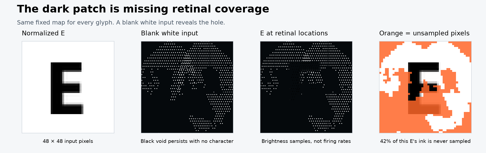

**The dark gap was mostly missing sampling coverage, not a model of a biological blind spot.** The original map has 3,335 receptors but only 825 distinct image locations. Many receptors share a location. Under bilinear sampling, only 1,198 of 2,304 glyph pixels can influence a sample: 52.0% coverage. The lower-left quadrant has only 79 receptors and 12.7% pixel support.

Across the synthetic training glyphs, 51.1% of total ink intensity lies on unsupported pixels. A direct intervention changes every unsupported pixel and leaves the sampled vector exactly unchanged. That is a concrete information bottleneck before the circuit.

The old display also used a black background for unoccupied locations. Since it plotted raw sampled brightness, absent locations and dark ink looked similar. The circuit subsequently inverts brightness; this plot was never retinal firing activity.

| Diagnostic readout, bypassing the circuit | Best validation accuracy |
| --- | --- |
| Full glyph pixels | 83.4% |
| Original retinal samples | 70.4% |
| Uniform sampling control | 83.6% |

These are validation-selected diagnostic classifiers, not equivalent end-to-end neural results. They motivate better input coverage but do not establish the size of its causal effect through the circuit. Source: `reports/retinal-diagnostic/results.json` and the accompanying intervention script.

<!-- pagebreak -->
# 3. Image coordinates versus a compound-eye atlas

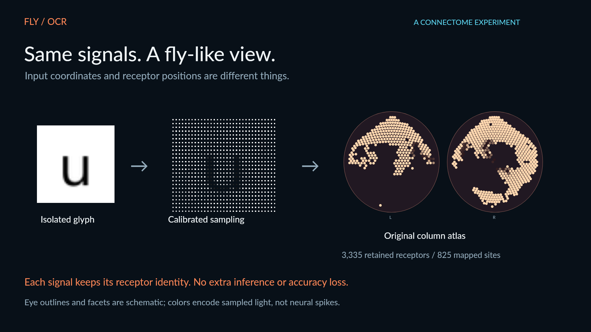

**Two independent coordinate systems now have explicit roles.** Image UV coordinates determine which pixels feed each receptor. Display coordinates determine where that receptor's recorded signal appears in the video. The atlas uses original left/right annotations and the original inferred lamina-column map. It retains the asymmetry: 1,107 left-side and 2,228 right-side receptor inputs.

The renderer separates the previously overlapping eye maps, curves the drawing into two ovals, and draws small hexagonal facets. A facet summarizes receptors sharing an inferred column position. Their samples are identical in the released mappings. Copper brightness is a monotone display scale for sampled light: a dark facet means less sampled light. Empty space remains empty; missing receptors are not filled in.

The oval surfaces, facet outlines and display warp are schematic. They are not reconstructed ommatidia, measured visual angles, or a claim about subjective fly perception. In real neural superposition, photoreceptors in different ommatidia can view the same direction and converge on one lamina cartridge [3]. A cartridge-derived atlas must not be confused with a literal eye-surface map.

**Measured impact: zero change to inference.** Attaching the atlas to all 11 recordings leaves every prior inference field unchanged. Resampling the saved glyphs reproduces the recorded retinal values. The calibrated model keeps 87.6% benchmark accuracy. Original-mapping checkpoints remain available for comparison; both modes use the same honest atlas view.

<!-- pagebreak -->
# 4. The input adapter and neural dynamics

The original coordinate map assigns R1-R6 cells to their strongest connected L1/L2/L3 anchor with an assigned hexagonal column. It converts the hex coordinates into a plane, independently normalizes each eye, then overlaps the two views. This is an inferred engineering projection, not optical calibration.

The calibrated adapter assigns the 825 distinct sites to a 33 x 25 rectangular sampling grid, minimizing total squared displacement. Receptors sharing an original site still share an input. It uses no labels or learned image encoder. Pixel support rises to 100%, but 825 sample locations cannot independently reconstruct all 2,304 pixels.

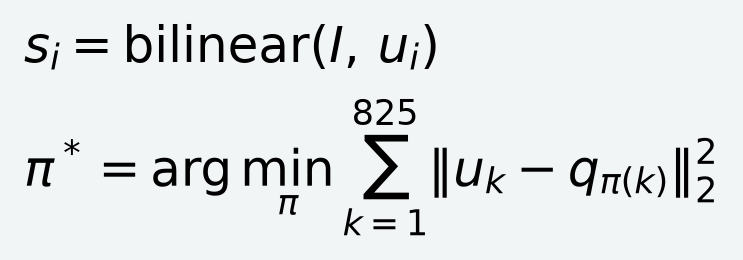

Here, I is the normalized glyph, u is a sample location, q is a grid target, and pi is a one-to-one assignment. The RMS site displacement is 0.2022 in normalized image coordinates. Moving samples changes the simulated visual input; it improves coverage while weakening correspondence to the original approximate visual fields.

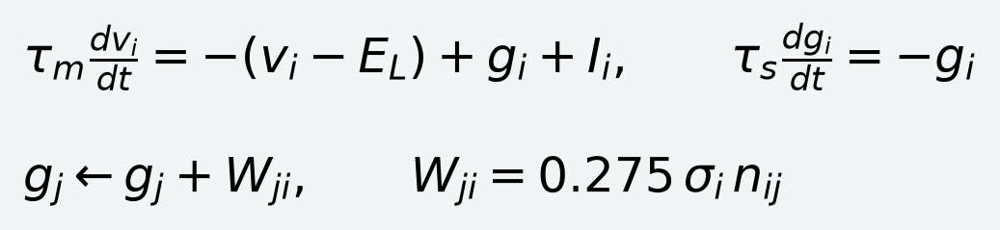

The implementation retains **166,700 neurons and 25,582,938 directed edges**. Each weight is contact count n times an inferred transmitter sign and a fixed 0.275 scale. Acetylcholine is positive; GABA, glutamate and histamine are negative. Unknown or ambiguous signs default positive for 3,718 cells. This and uniform dynamics are substantial assumptions.

The kernel uses a 0.1 ms grid, membrane time constant 20 ms, synaptic time constant 5 ms, rest/reset -52, threshold above -45, 1.8 ms delay and 2.2 ms refractory period. At a spike it resets voltage and synaptic state; incoming events during refractory state are ignored. These are implementation rules, not cell-specific physiology. The lazy solver skips only cells that cannot reach threshold under its bound, retaining every graph edge. A small-network test compares it with an independent Brian2 reference.

<!-- pagebreak -->
# 5. Stimulus and the compact nonlinear readout

A 50 ms blank warmup creates a canonical state. Every glyph restores that state: there is no cross-character neural memory. The selected stimulus inverts brightness, updates its filtered input once per 25 ms bin, applies a saturating sensory current, and supplies tonic drive to L1/L2/L3/L5 cells.

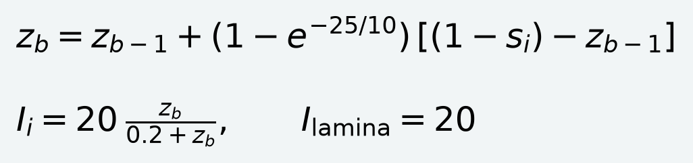

Here s is sampled brightness and z is the stimulus state. The receptor gain is 20, half saturation 0.2 and tonic lamina drive 20. This approximates contrast-sensitive input; it does not reproduce fly phototransduction, retinal adaptation, optics or natural motion. The recurrent network responds to these engineered currents.

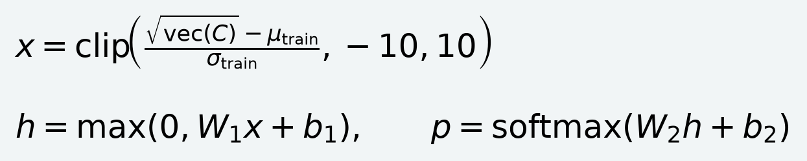

C contains four bins by 1,024 cells. Standardization statistics come from training only; near-zero scales are guarded. The square-root transform reduces the influence of high-count cells. The final head has **266,628 learned parameters**: 4,096 inputs, 64 hidden units and 68 outputs. It is a decoder of fixed circuit signals; gradients never enter the connectome.

| Calibrated-input head | Validation | Benchmark | Parameters |
| --- | --- | --- | --- |
| Raw counts, 64 units | 88.88% | 87.19% | 266,628 |
| Square root, 64 units (selected) | 89.06% | 87.56% | 266,628 |
| Square root, 64 then 32 | 88.33% | 86.34% | 266,532 |
| Square root, 128 then 64 | 88.33% | 86.09% | 537,092 |

The input change accounts for most of the observed improvement across these configurations. Square root adds only two correct validation examples and six benchmark examples over the calibrated raw-count head. Deeper heads did not help. Feature cells were reselected from training responses after changing input, so this comparison does not isolate remapping from cell selection and refitting.

<!-- pagebreak -->
# 6. Training protocol and glyph results

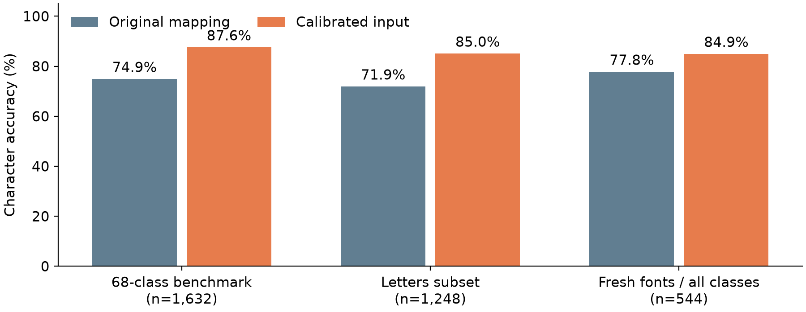

The alphabet has 68 classes. Synthetic training contains 96 samples per class (6,528 total), validation 16 (1,088), and the established benchmark 24 (1,632). Six training families are Roboto, Open Sans, Lato, Noto Sans, Source Sans 3 and Montserrat. PT Sans and Lora are validation families; Fira Sans and Noto Serif are benchmark families. Families are disjoint. Small size, weight, rotation, blur, baseline and occupancy variations mimic printed glyphs; PDF text is not training data.

The 1,024 readout cells are selected using variance in a training-only probe (eight glyphs per class) from optic-lobe intrinsic and visual-projection candidates. Directly driven retinal and lamina cells are excluded. Four head configurations use AdamW, learning rate 0.002, weight decay 0.01, dropout 0.1, batch 256 and validation stopping with patience 18, at most 120 epochs. Selection uses validation only.

**Benchmark:** 1,429/1,632 overall; uppercase 516/624 (82.7%), lowercase 545/624 (87.3%), digits 227/240 (94.6%), punctuation 141/144 (97.9%). Fira Sans scores 92.8%; Noto Serif 82.4%. The image-level Wilson interval is 85.9-89.1%; shared fonts violate simple independence, so it is not a font-generalization guarantee.

**Fresh check after model selection:** four examples per class per font on Verdana and Georgia, 544 total. Overall accuracy improves from 423/544 (77.8%) to 462/544 (84.9%); letters from 335/416 (80.5%) to 368/416 (88.5%). Georgia scores 72.8% and Verdana 97.1%. The established benchmark had already been inspected in earlier work, so it should not be called a new blind test. The fresh check is small and contains only two additional families.

<!-- pagebreak -->
# 7. Reading an actual document

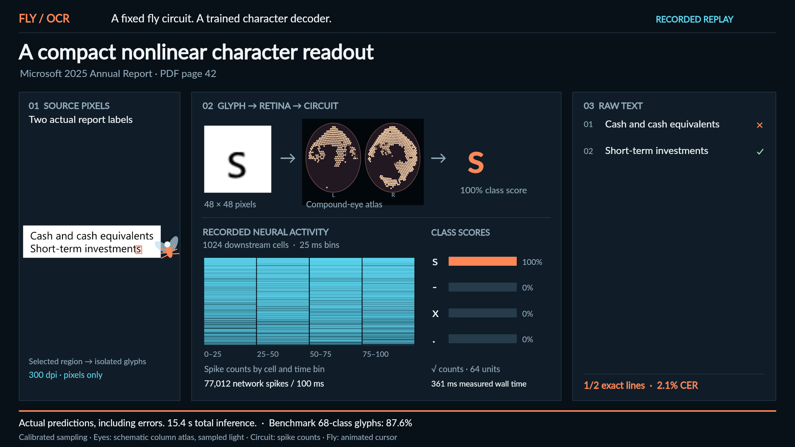

Three selected crops contain eight lines on PDF page 42 of Microsoft's 2025 Annual Report [5]. All 176 reference characters, including spaces, enter character-error scoring. The circuit receives 161 glyphs; preprocessing inserts spaces. No PDF labels, expected words or correction rules enter recognition.

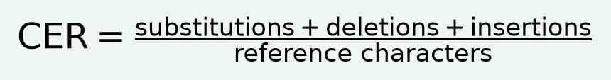

| Crop | Original CER | Calibrated CER | Exact lines, calibrated |
| --- | --- | --- | --- |
| BALANCE SHEETS heading | 28.6% | 14.3% | 0/1 |
| Cash and short-term labels | 14.9% | 2.1% | 1/2 |
| Five further asset labels | 20.0% | 6.1% | 0/5 |
| All eight lines | 19.3% (34 edits) | 5.7% (10 edits) | 1/8 |

The figure shows the raw capital I in `equivaIents`, even though the intended word contains a lowercase l. Confidence is a class score, not a calibrated probability that the character is right. Better character accuracy is still far from reliable paragraph OCR; isolated I/l and S/5 confusions remain conspicuous.

<!-- pagebreak -->
# 8. Errors are part of the result

The following strings are the exact calibrated outputs, including capitalization errors. They are not corrected using the surrounding words.

| Reference | Raw prediction |
| --- | --- |
| BALANCE SHEETS | `BALANCE 5HEET5` |
| Cash and cash equivalents | `Cash and cash equivaIents` |
| Short-term investments | `Short-term investments` |
| Operating lease right-of-use assets | `Operating Iease right-of-use assets` |
| Equity and other investments | `Equity and other investmenls` |
| Goodwill | `GoodwiII` |
| Intangible assets, net | `intangible assels, net` |
| Other long-term assets | `Other lonq-term assets` |

Some glyph pairs are nearly indistinguishable in the source font. Others differ in short strokes that can be blurred, normalized poorly, sampled coarsely or encoded similarly by the circuit. Line-relative normalization preserves useful case information, but estimated baselines and cap heights can be wrong. Touching glyphs, dots and punctuation remain fragile segmentation cases.

**Failure attribution has limits.** The recognition head receives no raw pixels, so downstream errors may arise from normalization, retinal sampling, fixed network transformation, cell selection or the readout. The blind-spot intervention isolates one input bottleneck; it does not explain every remaining error. An end-to-end page benchmark with independently verified glyph boxes would be needed to separate segmentation errors from conditional character recognition more rigorously.

**The closed alphabet matters.** Unsupported symbols are forced into the available classes unless the configured score threshold rejects them. The system does not have a trained universal unknown-character detector. A paragraph containing accents, mathematical notation, handwriting or multilingual text is out of the demonstrated scope. The old numeric model's failure on English letters remains in the example catalog as a direct illustration.

<!-- pagebreak -->
# 9. Tables and unusual formatting

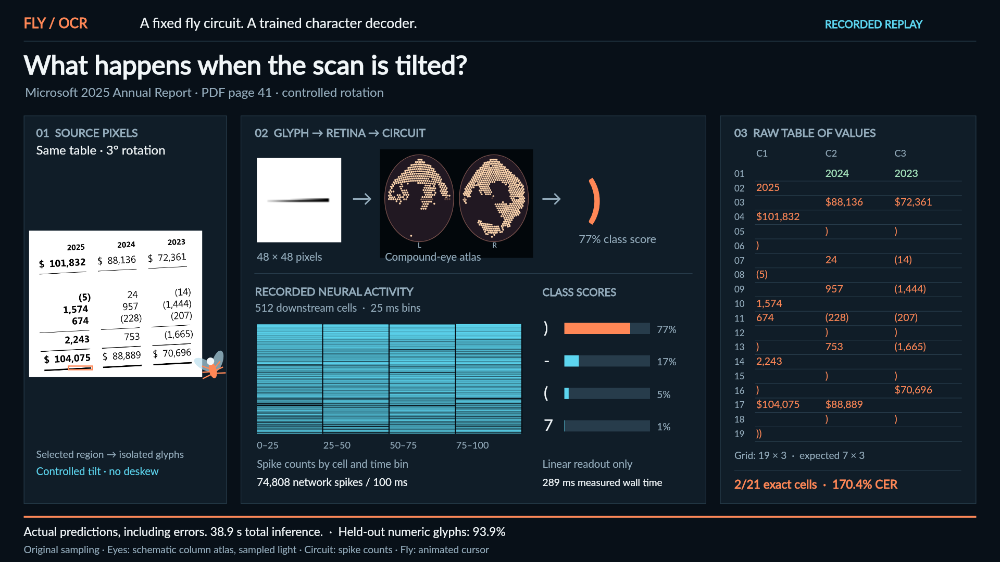

Numeric table mode estimates whitespace-separated columns and aligned row baselines from a selected crop. Its output is a matrix of recognized strings, plus raw CSV and JSON. This is geometric reconstruction around the fly circuit; the network does not understand table structure or financial meaning. The letter model currently accepts text regions and rejects the numeric `--table` combination.

| Numeric checkpoint example | Measured result |
| --- | --- |
| Original single column, PDF p40 | 18/19 exact cells; 119/120 glyphs. Error: 7,465 becomes 7.465. |
| Income table, PDF p41 | 7 x 3 detected grid; 21/21 exact cells; 108 glyphs. |
| Cash-flow values, PDF p43 | 15 x 3 grid; 44/45 exact cells; 299 glyphs. Error: (28,103) becomes (28,107). |
| Income table rotated 3 degrees | 19 x 3 detected instead of 7 x 3; 2/21 expected positions correct; 170.4% CER. |

The skew test retains all errors. Angled rules and disrupted row bands cause severe segmentation and alignment failures; CER can exceed 100% because insertions add errors. Dollar signs, commas, minus signs and parentheses are supported classes, but robust deskew, table discovery, merged cells and arbitrary document reading are not implemented.

<!-- pagebreak -->
# 10. Controls, compute and interpretation

**Signals matter, but biological superiority is unproven.** Mismatching recorded neural responses to labels reduces the calibrated 68-class benchmark to 2.3% accuracy, near the 1.5% balanced chance rate. In an earlier 200-example digit pilot, an intact circuit scored 82%; removing edges with its existing head scored 10%. Three degree-preserving target randomizations with retrained heads scored 65.0%, 63.5% and 54.5%. These are separate pilot controls, not results for the final letter model.

Randomization substantially changes activity scale, and the control budget is small. Therefore, it does not establish a special biological computational advantage. On the original 500-example digit test, a conventional raw-pixel linear classifier reached 99% and a small CNN 100%, versus 89% through the fly circuit. That split differs from the 68-class benchmark. An ordinary OCR system remains the practical choice for accuracy and generality.

| Local measurement | Value and scope |
| --- | --- |
| Machine | Apple M2 Pro, 32 GiB RAM; Python 3.11; native C++ circuit |
| Circuit, small paired timing sample | 0.295 s/glyph original; 0.289 s/glyph calibrated; 16 glyphs each |
| Readout only | About 0.71 ms/glyph original and 1.12 ms/glyph calibrated |
| V2 feature extraction | About 21.4 minutes with two CPU workers |
| Four-head fit | About 11.8 seconds using PyTorch MPS |
| Fresh and benchmark evaluation | About 392 seconds |
| Eight PDF lines | About 51.4 s for 161 glyphs with calibrated inputs |

There is one 100 ms circuit presentation per glyph. The atlas adds rendering work only. The tiny timing difference is not evidence of a speedup. The measured document runs were recorded in different execution contexts. Training benefits from MPS, but inference uses NumPy plus the native kernel and does not require PyTorch or a GPU. This project was run on the Mac; cloud execution is not needed for the demonstrated workload.

<!-- pagebreak -->
# 11. Reproducibility and fidelity choices

The public package includes the core Python implementation, C++ kernel, four main trained checkpoints and historical comparisons, source manifests, openly licensed fonts, saved inference events, attributed document excerpts, evaluation summaries, a static replay viewer, video renderers and this report. Large connectome downloads, virtual environments, machine caches, raw debug logs, obsolete hosting configuration and local paths are excluded from the public export.

**Replay without the connectome:** install Node.js 22.13 or newer, enter `viewer`, run `npm ci`, then `npm run dev`. The recorded examples need no cloud account or Python. `npm run build` produces a static site. Select an original or calibrated experiment; predictions remain those from its own checkpoint.

**Run new recognition:** install Python 3.11, uv and a C++ compiler. From the repository root, use `uv sync --python 3.11 --extra dev`, `uv run flyocr download`, and `uv run flyocr prepare`. Then run `uv run flyocr recognize your-crop.png --letters --output output/my-run`. Use `--artifact artifacts/letters` for the original letter mapping, or the default numeric model with `--table` for a numeric grid. PDF rasterization additionally needs Poppler. The README contains complete verification and training commands.

**Integrity:** model cards fingerprint the graph, stimulus, kernel and readout; the calibrated artifact also fingerprints its UV adapter. Replay checks reproduce class scores from saved counts, verify glyph images and recover text geometry from source pixels. The atlas has its own identity and receptor ordering checks. It is a display sidecar and does not alter model identity. Small-network tests exercise dynamics and resets; they are not a substitute for reproducing the scientific runs.

**The chosen balance:** preserve real graph connectivity and recorded responses; keep the trained decoder small; show the native column organization; explicitly identify the input calibration and schematic graphics. Future work could measure optical axes, preserve retinotopic neighborhood structure during remapping, or test small eye movements and multiple views. Those ideas require fresh held-out evaluation and compute accounting. None is implemented or claimed as a current gain.

<!-- pagebreak -->
# 12. Sources, provenance and limits

[1] **MaleCNS v1.0.** HHMI Janelia/FlyEM and collaborators. Dataset downloads, annotations, connectivity and CC BY terms: [male-cns.janelia.org/download](https://male-cns.janelia.org/download/). Project release information and associated paper: [MaleCNS project](https://male-cns.janelia.org/) and [Cell DOI](https://doi.org/10.1016/j.cell.2026.08.015). The simulation uses the retained graph defined by this repository's manifest, not every segmentation object in the raw release.

[2] **Shiu et al. (2024).** A Drosophila computational brain model reveals sensorimotor processing. Nature 634, 210-219. [Full paper](https://pmc.ncbi.nlm.nih.gov/articles/PMC11446845/) / [DOI](https://doi.org/10.1038/s41586-024-07763-9). Related precedent for simplified connectome-driven LIF simulation; its feeding and grooming results do not validate this OCR task or this visual adapter.

[3] **Langen et al. (2015).** The Developmental Rules of Neural Superposition in Drosophila. Cell 162, 120-133. [Author-hosted paper](https://www.flygen.org/pdfs/cell.2015.superposition.pdf) / [DOI](https://doi.org/10.1016/j.cell.2015.05.055). Supports the distinction between ommatidia, photoreceptors and convergent lamina cartridges.

[4] **DOOMFLY.** nftechie and contributors, MIT. [Pinned source revision](https://github.com/nftechie/doomfly/tree/71ecf53d78eaffaf1a57ed7b0ccf5d458abc9f33). Import, retinal projection and native dynamics were adapted from this code. Full MIT notice is included in `licenses/DOOMFLY-MIT.txt`.

[5] **Microsoft 2025 Annual Report.** [SEC-hosted document](https://www.sec.gov/Archives/edgar/data/789019/000119312525245177/d61995dars.pdf). PDF pages 40-43 supply the selected visual examples. Limited excerpts are attributed; report content is not covered by this project's MIT license. The full PDF is fetched separately with its recorded checksum.

[6] **Fonts.** Ten training/evaluation families from the [pinned Google Fonts repository](https://github.com/google/fonts/tree/809e4d8b8d7e9364a914909bb777679606c178b8), with SIL OFL notices and hashes in `assets/fonts`. Fresh checks use locally installed Georgia and Verdana; those proprietary font binaries are not redistributed.

**Project evidence:** `artifacts/letters-v2/recognition.json`; `reports/letters-v2/summary.json`; `reports/retinal-diagnostic/results.json`; `reports/retinal-atlas/verification.json`; `reports/more-examples`; `reports/controls`; and all saved `run.json` files. Figures and screenshots are generated from these measurements and the shared replay renderer. The compilation contains no synthesized recognition or hidden corrections.

**Scope statement:** this is an exploratory, connectome-constrained recognition demonstration with engineered preprocessing, approximate sensory input, uniform neural dynamics and a supervised readout. It neither recreates a complete fly nor establishes a mechanism for biological literacy. Its value is that the assumptions, measurements and errors are inspectable.
