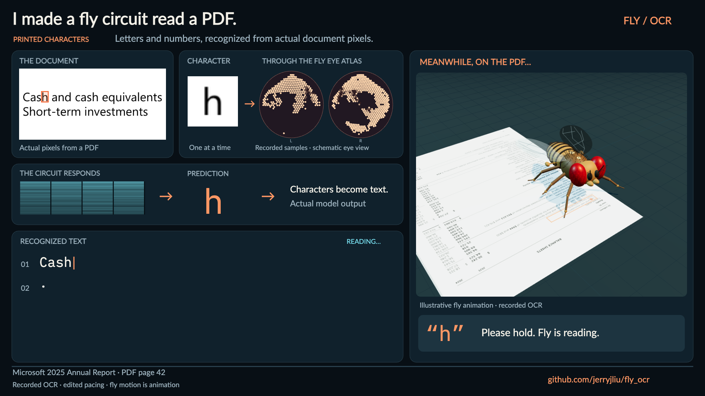

# Fly OCR: results-first teaser

[Watch the 40-second teaser](https://github.com/jerryjliu/fly_ocr/releases/download/teaser-v1/fly-ocr-teaser.mp4)



The teaser introduces the accomplishment before the implementation: a simulated
fly circuit recognizes printed characters from PDF pixels, and the surrounding
pipeline rebuilds numeric values into rows and columns. It uses final-model
recordings throughout. Input-mapping iterations, before/after comparisons and
ablation tables remain in the research report and longer walkthroughs.

| Time | Message | Evidence on screen |
| --- | --- | --- |
| 0:00–0:12 | A fly circuit reads printed characters | Mixed-case labels; scanning starts with the recorded word `Cash` already visible |
| 0:12–0:25 | Numbers return to rows and columns | The selected income-table crop, with 21/21 exact cells |
| 0:25–0:34 | A fixed circuit plus a small trained decoder | Five more labels, including actual recognition errors |
| 0:34–0:40 | Try the code and read the full experiment | Completed raw text, the animated fly, and the repository/report link |

The simplified labels emphasize the document, eye samples, circuit response,
recognized character and assembled result. Per-class scores, latency counters,
neuron-bin labels and benchmark comparisons are left to the detailed viewer.
The final text retains errors such as `GoodwiII`. The table score refers only
to the displayed crop; no general perfect-recognition claim is made.

The existing 3D fly and retinal atlas renderers are reused unchanged. Body
motion is illustrative animation; predictions, samples and activity come from
the saved runs. Timing is edited. See [visual methods](social-video.md) and
the [research report](research-report.md) for technical details and limitations.

## Reproduce and verify

After installing viewer dependencies and the Python video extra:

```sh
uv run --extra video python scripts/export-teaser.py
uv run --extra video python scripts/verify-teaser-media.py
```

`FLYOCR_PREVIEW_ONLY=1` renders first, middle and final stills of each chapter.
Chrome setup follows the [social-video instructions](social-video.md).

Output: `demo/teaser/fly-ocr-teaser.mp4`, H.264, 1920 × 1080, 24 fps,
960 frames, silent and captioned. Its manifest records source-run and renderer
hashes plus the event ID returned for each rendered frame. Verification checks
this trace against the recordings, decodes the entire video, and checks that
both previous compilation videos remain unchanged.
