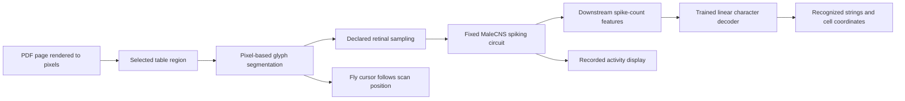

# Fruit-fly connectome OCR

## Recommendation

Build a small, testable OCR experiment around a **frozen MaleCNS spiking circuit and a trained linear character decoder**. Begin with isolated printed digits, then recognize the numbers in a selected financial-statement crop. Use the visible fly as a scanning cursor whose position follows the crop being presented. The first deliverable should demonstrate recognition through recorded neural activity; a realistic walking or flying body is unnecessary.

This is technically plausible, but the available evidence does not establish that the specific MaleCNS circuit and approximate dynamics will preserve enough glyph information for useful recognition. The first milestone should answer that question. A full-page parser, table-structure understanding, and dopamine-trained reading would each require substantial additional work.

The intended claim is precise: **“We used a simulated fruit-fly connectome as a fixed visual reservoir, trained a small decoder, and tested it on numbers in a PDF.”** The decoder learns character labels. The reconstructed internal connections remain fixed. If the experiment succeeds, it demonstrates an engineered OCR system using fly-circuit activity; it does not establish that a biological fly can read.

The implementation should start on the available M2 Pro Mac with 32 GiB of memory. Capacity appears reasonable, while throughput remains unmeasured. Modal CPU workers provide a practical fallback for independent image batches. A GPU is useful only after the simulator has an appropriate GPU implementation or a different differentiable model is selected.

## What the research and demos actually provide

### The dataset

Google’s September 3, 2026 announcement concerns the male fruit-fly central nervous system connectome, produced with HHMI Janelia and other collaborators. It provides reconstructed anatomy and connectivity, rather than trained OCR weights or a turnkey behavioral agent. The project’s own chronology lists **June 8, 2026 for MaleCNS v1.0 data release** and September 3 for publication of the paper. The viral announcement should not be confused with the first availability of the data.[^1][^2]

Bulk annotations, neurotransmitter information, and connectivity tables are publicly available. For this experiment, those tables are sufficient: downloading the underlying electron-microscopy volume or every neuron mesh would add considerable complexity without helping character recognition.[^3]

DOOMFLY’s pinned importer retains 166,700 annotated neuron candidates and 25,582,938 directed connection rows, representing 124,177,617 synaptic contacts. Its source tables contain additional segmentation objects and connections outside that inclusion policy. “Full retained graph” is the accurate description; it does not mean every raw segmentation object is simulated. A connection row can summarize multiple anatomical contacts, so “25.6 million connections” and “124.2 million contacts” describe different quantities.[^4]

The anatomy constrains which cells communicate and the relative contact counts. It does not uniquely determine receptor effects, membrane properties, operating state, retinal encoding, or learning rules. A useful simulation therefore combines measured structure with explicit modeling assumptions.

### DOOMFLY

DOOMFLY is the strongest reusable engineering reference examined. Its baseline combines a retained MaleCNS graph, approximate leaky integrate-and-fire dynamics, visual stimulation, and a manually chosen neural-to-game interface. The repository distinguishes that baseline from its experimental learning configuration.[^5]

Its visual map infers receptor positions from connections to annotated lamina columns. The overlapping eye viewports are an engineered projection, rather than a calibrated optical model. The preparation code explicitly acknowledges that photoreceptors and lamina cells are represented by a coarse spiking approximation even though those cells have graded physiology.[^6]

The game decoder maps selected neural activity to turning, motion, and firing. This is evidence that the circuit causally participates in the control loop, but there is no natural “shoot” neuron. The repository’s neuroscience audit reports that black-input controls outperformed live vision in its short historical comparisons; those comparisons do not establish a general visual advantage.[^7]

The experimental v6 configuration really does change weights: a damage-triggered stimulus and an added plasticity rule affect 4,184 existing KC-to-MBON11 connections. However, its published protocol says the candidate failed visual, conditioning, and survival validation. Weight changes establish that a learning mechanism runs, not that useful learning occurred.[^8]

**Implication for OCR:** reuse the importer, numerical conventions, and instrumentation as references. Do not inherit the claim that a working visual representation or useful reinforcement learning already exists.

### Beat Saber and the courtship demo

Lyra’s follow-up to the Beat Saber post explicitly describes a model overfit to one track, receiving some replay-derived input, with teacher forcing being reduced during further training. The author says movement is generated through the connectome; it is not simply a predefined animation replay. This supports a constrained training demonstration, not evidence of general gameplay from visual pixels alone. A matching public implementation was not established from the examined profile and posts.[^9]

Nico’s Fruitless repository makes the display mechanism unusually clear: it replays neural recordings, while the fly’s movement is illustrative choreography. Its results concern changes in candidate courtship-neuron responses after blocking an inhibitory pathway. Those recordings do not predict the displayed flight or mating behavior. Its 166,606-node graph also uses a different inclusion policy from DOOMFLY.[^10]

These distinctions suggest a good presentation rule for the PDF demo: actual recognition events should drive the revealed text, while the fly’s scanning motion can be explicitly identified as interface animation.

### Physics-based fly bodies also exist

NeuroMechFly/FlyGym provides a biomechanical body, simulated sensing, controllers, and interaction with a MuJoCo environment. It is more than an animated mesh, but coupling an anatomical neural model to it is a separate modeling problem. A detailed body does not automatically provide a validated connectome-to-muscle controller.[^11]

For this project, body physics would distract from the key uncertainty: whether characters can be decoded from the neural representation. Use a simple original fly cursor initially. Anatomical meshes can be added later with their own attribution.

## The model in ML terms

The useful analogy is a **recurrent network with persistent state and a special activation rule**. “ODE versus neural network” is not a clean division: differential equations can describe a neural network, and a computer simulates continuous dynamics through discrete operations.

For an ordinary recurrent model, one might write:

```text
h_next = F(h_current, image_features)
```

Here the state contains membrane voltage, recent synaptic drive, refractory timers, and delayed spikes. The same update rule is reused over many short intervals. The anatomical graph plays the role of a fixed recurrent weight matrix; it is sparse and can contain feedback loops.

### A single cell

In the DOOMFLY baseline, between spike events:

```text
voltage change rate = (rest - voltage + external_drive + synaptic_drive) / 20 ms
synaptic_drive change rate = -synaptic_drive / 5 ms
```

Rest is −52 mV and the firing threshold is −45 mV. A spike resets the modeled cell and initiates a refractory interval; delayed outgoing events affect connected cells. The implementation checks thresholds on a 0.1 ms grid and uses an analytic subthreshold update, not the simple Euler update shown in the pasted conversation. Event order and the treatment of refractory arrivals matter.[^12][^13]

The drive terms in this simplified equation are voltage-equivalent quantities. They should not be interpreted as measured physical currents or a detailed conductance model. Changing the numerical timestep is also not automatically harmless: threshold timing and delay discretization must remain consistent.

For intuition, consider a cell at rest with an external drive of 10 mV and no synaptic drive. A pedagogical Euler step of 0.1 ms would increase its voltage by `0.1 × 10 / 20 = 0.05 mV`. Further increments shrink as voltage approaches its driven equilibrium. Crossing the threshold produces an event, not a class probability. This arithmetic illustrates the equation; it is not an OCR result or the production solver.

Shiu and colleagues’ published model supplies relevant scientific precedent for simple connectome-based dynamics. They tested predictions about specific fly sensorimotor behaviors and documented important missing physiology. Their results support the usefulness of approximate models for bounded questions; they do not validate arbitrary pixels-to-OCR transformations or the later male-graph adaptation.[^14]

### Where the matrix multiplication went

If `s` records which cells just spiked and `W[j,i]` describes a connection from cell `j` to cell `i`, synaptic delivery has a matrix-like interpretation: add `Wᵀs` to the postsynaptic drive, accounting for delays and refractory rules. An event-based implementation visits outgoing connections only for firing cells. This is still a neural computation; it simply uses recurrent dynamics and discrete spike events instead of a feedforward sequence of dense layers.

The final OCR head can be entirely familiar:

```text
features = spike counts from selected downstream cells in several time bins
class_probabilities = softmax(B @ standardized_features + bias)
```

`B` and the bias are learned from labeled glyph images. No cell is presumed to mean “3.” The classifier learns which population patterns distinguish 3 from 8, 9, and other classes. At inference, it receives only the neural features.

### Why a fixed circuit could work

Reservoir computing uses a fixed dynamical system to transform inputs into a representation, then trains a readout. Liquid-state-machine research supplies a foundational precedent for this division of labor with recurrent spiking circuits.[^15]

That precedent establishes an approach, not a guarantee for MaleCNS. The circuit must preserve useful differences between inputs, and those differences must be accessible to a small decoder. Silent output populations, widespread saturation, or almost identical responses to every glyph would defeat the experiment.

A frozen reservoir also cannot add information absent from its input. Better performance than raw pixels would indicate a useful representation or inductive bias for the chosen training regime, not the creation of new visual information. It could instead perform worse and still support above-chance recognition through real simulated activity.

### Where dopamine would fit later

The first version needs no dopamine mechanism: supervised examples train the output decoder directly. Adding a scalar reward to a later experiment would still require an explicit rule connecting that reward to changes in eligible synapses, a definition of which parameters may change, and an evaluation of retention and held-out improvement. Stimulating a named dopamine cell alone supplies none of those guarantees. Learning to select a useful crop could be a more manageable later reinforcement task than learning a full character vocabulary from sparse rewards.

## Proposed recognition pipeline



The arrows into the decoder are the critical boundary. The decoder must not also receive pixel embeddings, PDF text, crop filenames, cell coordinates, or document identity. Page coordinates may organize recognized characters into cells after recognition; they should not help predict a character.

### 1. Render and crop

Render a PDF page at a declared resolution, initially 300 DPI. Select a numerical table region and use image geometry to identify lines, cells, and glyph candidates. The first demonstration can use an explicitly supplied table rectangle; detecting arbitrary tables across arbitrary PDFs is a separate task.

A manual table rectangle is not a character answer, but it is assistance that should be disclosed. Likewise, a benchmark with manually supplied glyph boxes measures recognition alone. It must be reported separately from the eventual pipeline with pixel-based segmentation.

### 2. Present one glyph at a time

Normalize the glyph crop to a fixed canvas while preserving aspect ratio and padding. Present a magnified image to the inferred retinal map. This makes the task analogous to reading through a microscope rather than showing an entire dense financial statement at once.

Begin with the published baseline encoding as a reference. Compare it with a small, declared set of current gains and contrast transformations, selected on development data. Maintain spatial identity: pooling every neuron of a cell type into one scalar could discard where the strokes are.

The baseline’s brightness transform is strongly saturating. Whether this harms dark-on-light glyphs is a hypothesis to test, not an established failure. Fixed micro-movements of the crop can provide temporal contrast if static presentation is insufficient; their schedule must be identical across labels and described as an engineered stimulus.

### 3. Reset consistently

Start each independent glyph from the same canonical state, including delayed events and sensory-filter history. A label-independent blank presentation may define that state. This makes feature caching reliable and prevents sample order from becoming an accidental label signal.

A continuous page-scanning experiment can be added later. It would require its own evaluation because history would affect each prediction. Display continuity does not require neural continuity: the cursor may move smoothly while the recognizer resets between glyphs.

### 4. Read the circuit broadly enough

Use spatially identified visual-pathway neurons downstream of directly driven inputs. Do not restrict OCR to DOOMFLY’s four game-control cells. A starting design is 512 selected downstream neurons, each measured in four temporal bins: 2,048 features.

Choose the feature population using anatomy and training-only response statistics, excluding externally driven receptors and tonic-input populations from the primary head. Preserve the identities of all selected neurons. If the candidate population lacks activity or sufficient coverage, expand it through a documented development experiment.

A 10-class linear head on these features has 20,490 coefficients including biases. A 16-class head has 32,784. Those counts are design arithmetic, not fitted models. Training only the head avoids backpropagating through the entire spiking simulation and allows multiple classifier trials to reuse cached activity.

### 5. Assemble visible output

Initially recognize digits. Then add the punctuation required by the chosen numeric crop: comma, decimal point, parentheses, minus, and dollar sign, for 16 visible-character classes. Empty space is handled by segmentation; rejected or ambiguous glyphs appear as unknowns instead of being silently filled in.

Build strings in geometric order and export cell coordinates plus raw recognized text. A numeric-only CSV can use neutral row and column identifiers. Row labels, accounting semantics, units, and chart descriptions must not appear as if the character recognizer inferred them unless those capabilities are separately implemented and tested.

## A concrete PDF target and training curriculum

Microsoft’s 2025 annual report, available from the SEC, contains a clean income-statement table on **printed page 38, PDF page 40, zero-based page index 39**. It includes three year columns, a bold current-year column, comma-separated figures, negative values in parentheses, and decimal per-share amounts. This is a useful bounded stress test of both recognition and segmentation.[^16]

Use one preselected numeric column for the main held-out demonstration, including its normal variation in punctuation and font weight. Select the region before seeing recognition results. A different document or synthetic pages should be used for development so the final display does not become a memorized test crop.

The curriculum should be:

1. **Printed digits:** balanced classes, multiple openly licensed font families, size and position variation, antialiasing, and small image degradations.
2. **Held-out typography:** split by font family, not merely by randomly generated images. Related variants of the same rendered glyph stay in one split.
3. **Numeric strings:** multi-character cells with punctuation; assess character errors and whole-cell exact matches separately.
4. **Real PDF column:** all preselected cells, including errors and rejects, after the model and thresholds are frozen.

NIST’s EMNIST is an optional sanity benchmark, not the primary training distribution. It consists of handwritten characters in 28×28 images; strong results there would not establish transfer to printed financial statements.[^17]

A practical pilot uses roughly 1,000 training glyphs, 200 validation glyphs, and 500 sealed test glyphs, balanced over ten digits. Those sizes are initial experiment parameters. Expand only after checking neural responsiveness and pilot throughput. For a more credible release, increase the final held-out set and add a second PDF after the initial result is frozen.

## Evidence required to call it successful

Three different claims require different evidence.

| Claim | Necessary evidence | Insufficient evidence |
|---|---|---|
| Activity carries glyph information | Held-out decoding above majority/chance controls | Different-looking spike plots |
| Recognition uses internal circuit transmission | Neural-only head, input/edge ablations, downstream readouts | A successful classifier that also sees pixels |
| Biological wiring helps the task | Fair comparisons with randomized wiring and matched baselines | Any above-chance accuracy |

The primary comparison set should include a linear classifier on normalized pixels, a classifier on the retinal samples, the intact-circuit readout, and majority prediction. A small conventional CNN can serve as a task difficulty reference. Give comparable classifiers the same labeled training examples and development budget.

Add two distinct kinds of intervention. At inference, zeroing graph edges or blanking inputs tests whether the intact model’s output depends on those signals; performance loss alone may also reflect distribution shift. Separately retrain a readout for degree- and transmitter-sign-matched randomized graphs to test whether the original topology offers a useful representation. Report activity-rate mismatches in the controls instead of treating a silent randomized circuit as a fair comparison.

Shuffle training labels and compare with the held-out truth as a leakage check. Separately break image-to-feature pairings at evaluation to test whether a feature record is associated with its claimed input. Never shuffle test truth and then present the resulting score as model performance.

Use accuracy and macro-F1 for isolated balanced characters, character error rate for strings, whole-cell exact match, and rejection coverage. Include every selected cell in the denominator; a rejected cell is not a correct cell. Report sample counts and uncertainty, preferably with resampling grouped by font or document where dependence matters.

Suggested product gates are **90% isolated held-out printed-digit accuracy**, followed by **80% exact match over at least 15 preselected real numeric cells**, with raw outputs and coverage visible. These are proposed milestones, not predictions or statistical evidence thresholds. A small real-PDF sample supports a bounded demonstration, not a general OCR benchmark. Failure should produce a useful diagnostic report rather than trigger a hidden switch to conventional OCR.

## Alternatives and their tradeoffs

| Approach | Advantages | Limitations | Role |
|---|---|---|---|
| Full retained MaleCNS LIF reservoir + linear head | Closely matches the meme’s substrate; inspectable; freezes internal wiring | Visual dynamics uncertain; potentially slow | Recommended first experiment |
| Explicit MaleCNS visual subgraph | Faster feature extraction; easier to probe | Changes circuit boundaries and “whole brain” claim | Conditional performance experiment |
| FlyVis visual model + readout | Designed for visual stimuli; differentiable; pretrained models available | Different model and anatomical scope | Scientific fallback |
| Train many internal SNN weights | More task adaptability | Large optimization problem; changes fidelity and compute needs | Later research |
| Fly-controlled attention + LlamaParse | Strong product demonstration potential | LlamaParse performs recognition | Separate hybrid concept |

FlyVis is particularly relevant. Its published model uses a connectome-constrained visual network with graded dynamics and task optimization. Its anatomical construction tiles a local connectivity architecture over retinotopic space; it is not the newly released full MaleCNS graph. The paper’s MNIST section uses artificial networks to study identifiability, so it must not be cited as a demonstration that the actual fly connectome already reads digits.[^18] The official package includes custom-stimulus tutorials and pretrained-model workflows.[^19]

If the MaleCNS pilot fails because of visual encoding, first diagnose the failure within the agreed model family. Moving to FlyVis would be an explicit model change with a revised description. It should not be used silently to preserve a “166,700-neuron brain” headline.

## Mac feasibility and the Modal fallback

The inspected machine has an Apple M2 Pro, 12 logical CPUs, 32 GiB of memory, and approximately 25 GiB of available disk space. These are local observations, not a performance benchmark. The workspace contained no existing implementation at the start of this study.

DOOMFLY’s source manifest lists approximately 1.11 GB of compressed source tables in total. A compact retained graph containing one int32 destination and one float32 weight per edge occupies roughly 205 MB before pointer arrays, annotations, state, events, and temporary processing arrays. Import and analysis can require much more memory; source-file size is not a RAM estimate.[^4]

Its performance report observed the baseline on an M1 Pro with 16 GiB RAM. It also documents how linear-algebra thread oversubscription affected the surrounding pipeline and reports a short later sample at 0.662 simulated seconds per wall second. These measurements support trying a local implementation, but they cannot be transferred directly to PDF stimuli or this Mac.[^20]

Use one CPU simulation worker first and compile the native kernel locally. Benchmark a small representative glyph batch after warm-up, recording import peak memory, glyphs per second, and neural-time versus wall-time. Start with BLAS libraries limited to one thread inside each simulation worker, then measure whether additional independent workers help.

Cache compact feature vectors, not all neurons’ voltages at every timestep. At 2,048 float32 features, one glyph takes about 8 KB before metadata. Ten thousand glyphs therefore need about 82 MB of feature payload. Full voltage histories could exceed the available disk by orders of magnitude. Retain detailed traces only for a small declared set of demonstrations and diagnostics.

Consider Modal if the measured projected feature-extraction job exceeds an overnight local run, local memory pressure becomes unacceptable, or the disk reserve would be exhausted. Begin with **one physical CPU core and 8 GiB memory per worker** as a benchmark configuration, then adjust to observed needs. The existing serial C++ kernel does not automatically become faster when assigned eight CPU cores or a GPU. Parallelize independent glyph shards, each restoring the canonical neural state.

Modal supports explicit CPU/memory requests and persistent Volumes. Use a pinned Linux build, read-only graph inputs, unique output paths per worker, and checksummed feature shards. Persist checkpoints and identify completed shards so interruption does not require starting again.[^21][^22]

At the standard Functions prices checked on September 12, 2026, one physical core plus 8 GiB costs approximately **$0.111 per worker-hour** in CPU and memory charges. Eight such workers active for an hour are approximately **$0.889**, excluding storage, transfers, extra CPU usage, other fees, and plan-specific adjustments. This is resource-price arithmetic, not an estimate that the experiment finishes in one hour. Sandbox pricing differs.[^23]

An eventual CUDA/FlyVis branch could use a Modal GPU after its compatibility and batch throughput are measured. For the recommended first implementation, CPU batch distribution is the simpler fallback.

## Video and repository deliverables

The demo should make the computational chain legible in about 30–45 seconds. Show the real PDF page, zoom into the selected numeric column, and follow a fly cursor as glyphs are presented. Display the exact retinal input, a sampled activity trace, and character probabilities. Append a character only after its recorded inference result exists.

Use a visible label such as “fixed fly circuit + trained character decoder.” If the scene replays a recorded run, label it as replay; if time is accelerated, show the factor and original runtime. A 30 FPS video need not imply 30 neural decisions per second. Presentation smoothing must not alter the input record or recognition output.

Include one recognizable failure or uncertain character when it occurs naturally, and finish with the measured result across the full selected crop. The branding can say “LlamaIndex experiment” without suggesting LlamaParse generated the fly-only output. Any LlamaParse comparison should occupy a separate, clearly labeled lane and should be added only as a subsequent product experiment.

The eventual repository should contain a reproducible data downloader, documented graph inclusion rules, model configuration, training and evaluation commands, a model card, the small readout checkpoint, a recorded demo bundle, and the viewer. Large source tables belong in an external cache. A fresh checkout should reproduce the bundled predictions and, with the dataset downloaded, regenerate the neural features.

DOOMFLY’s original code is MIT; Fruitless’s original code is ISC; FlyVis’s code is MIT. MaleCNS is offered under CC-BY. Keep code, data, and visual-asset notices separate, preserve required upstream notices, and record modifications. Prefer a script that obtains the public sample PDF and verifies its checksum to bundling a full annual report. These are repository-design choices, not a claim that all third-party assets share one license.[^2][^24]

## Decisions and unresolved empirical questions

The selected direction is actual recognition using a small trained readout, starting locally and considering Modal if necessary. Research and planning are complete enough to begin a bounded pilot after this planning phase. No OCR accuracy, model throughput, or cloud execution result is claimed here.

The remaining uncertainties should be resolved experimentally:

- Do mapped retinal inputs preserve glyph distinctions after entering downstream cells?
- Which fixed presentation interval and downstream feature population are sufficient?
- Does a modest decoder generalize across font families and a real PDF crop?
- How much error comes from segmentation versus character classification?
- Does original wiring help compared with fair controls, or merely serve as a usable transformation?
- Can the chosen configuration process the training corpus within local time and storage limits?

There is no additional user decision required to specify the pilot. The detailed plan in `plans/2026-09-12-fly-brain-pdf-ocr.md` defines experiments, file responsibilities, verification, and fallback conditions. A broader launch date, full alphabet, or realistic body can be scoped after the pilot has evidence.

## Sources

Sources were checked on September 12, 2026. DOOMFLY code references below are pinned to commit `71ecf53d78eaffaf1a57ed7b0ccf5d458abc9f33` (September 9). Claims about outcomes in external repositories are their authors’ reported results, not independent reproductions. The original X threads were readable in a browser; the scientific paper, code, and protocol links supply the stronger technical evidence where available.

[^1]: Michał Januszewski and Viren Jain, Google Research. [A connectomics milestone: Mapping the complete male fruit fly brain](https://research.google/blog/a-connectomics-milestone-mapping-the-complete-male-fruit-fly-brain/). September 3, 2026. Announcement and scientific context; links to the [Cell paper](https://doi.org/10.1016/j.cell.2026.08.015), whose full publisher text was not accessible here.
[^2]: HHMI Janelia and collaborators. [Male CNS Connectome project page](https://male-cns.janelia.org/). Release chronology and dataset license.
[^3]: HHMI Janelia and collaborators. [MaleCNS downloads](https://male-cns.janelia.org/download/). Bulk connectivity and annotation access.
[^4]: Alex Wormuth / nftechie. [Normalized MaleCNS import report](https://github.com/nftechie/doomfly/blob/71ecf53d78eaffaf1a57ed7b0ccf5d458abc9f33/data-provenance/malecns_v1/normalized/report.json). Retained counts, excluded objects, source hashes and sizes.
[^5]: Alex Wormuth / nftechie. [DOOMFLY repository overview](https://github.com/nftechie/doomfly/blob/71ecf53d78eaffaf1a57ed7b0ccf5d458abc9f33/README.md). Architecture and baseline/experimental distinction.
[^6]: Alex Wormuth / nftechie. [Graph and retinal preparation](https://github.com/nftechie/doomfly/blob/71ecf53d78eaffaf1a57ed7b0ccf5d458abc9f33/doom/prepare.py#L13). Inferred eye projection and declared visual approximations.
[^7]: Alex Wormuth / nftechie. [Neuroscience and implementation review](https://github.com/nftechie/doomfly/blob/71ecf53d78eaffaf1a57ed7b0ccf5d458abc9f33/docs/doom-neuroscience-review.md). September 5, 2026. Fixed decoder, controls, and limitations.
[^8]: Alex Wormuth / nftechie. [Live experimental training protocol](https://github.com/nftechie/doomfly/blob/71ecf53d78eaffaf1a57ed7b0ccf5d458abc9f33/docs/doom-live-training.md) and [plasticity rule](https://github.com/nftechie/doomfly/blob/71ecf53d78eaffaf1a57ed7b0ccf5d458abc9f33/doom_learning_v6/rule.py). September 5, 2026. Scope and failed validation of the experimental update mechanism.
[^9]: Lyra Bubbles. [Original Beat Saber post](https://x.com/_lyraaaa_/status/2097527368919470162), September 8, 2026; [replay/teacher-forcing clarification](https://x.com/_lyraaaa_/status/2097726318662328415), September 9, 2026. Author report, not independently reproduced.
[^10]: Nico / nicodunks. [Fruitless README](https://github.com/nicodunks/fruitless/blob/0943b2c00b47a97c8e22438b11192b33d6779f56/README.md), September 10, 2026; [original X thread](https://x.com/nicochristie/status/2098106823970828606). Recorded responses and illustrative movement.
[^11]: NeuroMechFly authors. [NeuroMechFly documentation](https://neuromechfly.org/) and [NeuroMechFly v2 paper](https://www.nature.com/articles/s41592-024-02497-y), Nature Methods, 2024. Body simulation and sensing.
[^12]: Alex Wormuth / nftechie. [Neural engine](https://github.com/nftechie/doomfly/blob/71ecf53d78eaffaf1a57ed7b0ccf5d458abc9f33/doom/engine.py#L50) and [native kernel](https://github.com/nftechie/doomfly/blob/71ecf53d78eaffaf1a57ed7b0ccf5d458abc9f33/doom/kernel.cpp#L12). Solver, states, and current encoder.
[^13]: Brian simulator maintainers. [Refractoriness](https://brian2.readthedocs.io/en/stable/user/refractoriness.html) and [Numerical integration](https://brian2.readthedocs.io/en/stable/user/numerical_integration.html). Documentation of clamping and solver semantics.
[^14]: Philip K. Shiu et al. [A Drosophila computational brain model reveals sensorimotor processing](https://www.nature.com/articles/s41586-024-07763-9). Nature, October 2, 2024. Published model, experiments, and limitations.
[^15]: Wolfgang Maass, Thomas Natschläger, and Henry Markram. [Real-Time Computing Without Stable States](https://igi-web.tugraz.at/PDF/130.pdf). Neural Computation 14(11), 2002. Foundational liquid-state-machine formulation; [bibliographic record](https://pubmed.ncbi.nlm.nih.gov/12433288/).
[^16]: Microsoft. [2025 annual report, SEC-hosted PDF](https://www.sec.gov/Archives/edgar/data/789019/000119312525245177/d61995dars.pdf). Printed page 38 / PDF page 40, income statements. Visually inspected. SHA-256: `e88c300dcc58dcc93a88fa4afc6bd7b2e63a2095c7a6479d49d57692e1d19a6d`.
[^17]: Gregory Cohen et al. / NIST. [The EMNIST Dataset](https://www.nist.gov/itl/products-and-services/emnist-dataset). 2017. Handwritten-character benchmark scope.
[^18]: Janne K. Lappalainen et al. [Connectome-constrained networks predict neural activity across the fly visual system](https://pmc.ncbi.nlm.nih.gov/articles/PMC11525180/). Nature, 2024. Visual DMN and separate artificial-network MNIST experiment.
[^19]: TuragaLab. [FlyVis repository](https://github.com/TuragaLab/flyvis/tree/92b3845cc426dd309a1a0e1b3890156c42e14021) and [custom-stimulus tutorial](https://turagalab.github.io/flyvis/examples/07_flyvision_providing_custom_stimuli/). Repository snapshot August 6, 2026.
[^20]: Alex Wormuth / nftechie. [Performance investigation](https://github.com/nftechie/doomfly/blob/71ecf53d78eaffaf1a57ed7b0ccf5d458abc9f33/docs/doom-performance-review.md). September 5, 2026. Author-reported Mac observations, not an OCR benchmark.
[^21]: Modal. [Configuring CPU, memory, and disk](https://modal.com/docs/guide/resources). CPU requests and resource semantics.
[^22]: Modal. [Volumes](https://modal.com/docs/guide/volumes). Persistent data, commits, and concurrent-writer behavior.
[^23]: Modal. [Pricing](https://modal.com/pricing). Standard Functions CPU and memory rates checked September 12, 2026; calculated examples exclude other charges.
[^24]: [DOOMFLY third-party notices](https://github.com/nftechie/doomfly/blob/71ecf53d78eaffaf1a57ed7b0ccf5d458abc9f33/THIRD_PARTY_NOTICES.md), [Fruitless license](https://github.com/nicodunks/fruitless/blob/0943b2c00b47a97c8e22438b11192b33d6779f56/LICENSE), and [FlyVis license](https://github.com/TuragaLab/flyvis/blob/92b3845cc426dd309a1a0e1b3890156c42e14021/license). Code scope and upstream attribution.
